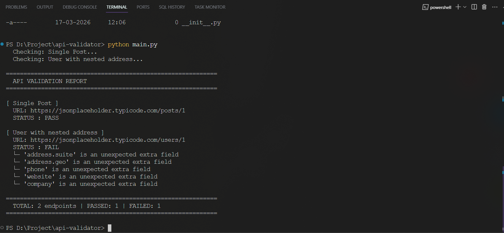

# API Response Validator

A command-line tool that validates API endpoint responses against expected JSON schemas.
Detects missing fields, type mismatches, and unexpected extra fields — including nested objects.

## What it does

- Accepts a list of API URLs and an expected schema via a JSON config file
- Makes GET requests to each endpoint
- Compares the actual response against the expected schema
- Flags missing fields, type mismatches, and extra fields
- Outputs a clear pass/fail report per endpoint with specific mismatch details

## Project Structure
```
api-validator/
├── main.py                  # CLI entry point
├── requirements.txt
├── config/
│   └── sample.json          # Endpoint URLs and expected schemas
└── validator/
    ├── fetcher.py            # HTTP GET requests with error handling
    ├── comparator.py         # Schema comparison logic (supports nested objects)
    └── reporter.py           # Formats and prints the validation report
```

## Setup
```bash
git clone https://github.com/YOUR_USERNAME/api-validator.git
cd api-validator
pip install -r requirements.txt
```

## Usage

Run with the default config:
```bash
python main.py
```

Run with a custom config file:
```bash
python main.py --config path/to/your/config.json
```

## Config Format
```json
{
  "endpoints": [
    {
      "name": "Single Post",
      "url": "https://jsonplaceholder.typicode.com/posts/1",
      "expected_schema": {
        "userId": "int",
        "id": "int",
        "title": "string",
        "body": "string"
      }
    }
  ]
}
```

Supported types: `string`, `int`, `float`, `bool`, `list`, `dict`

For nested objects, mirror the structure directly in the schema:
```json
"address": {
  "city": "string",
  "zipcode": "string"
}
```

## Sample Output



## Sample APIs Used for Testing

- `https://jsonplaceholder.typicode.com/posts/1` — flat response, all fields match
- `https://jsonplaceholder.typicode.com/users/1` — nested address object, extra fields detected as warnings
```

---
